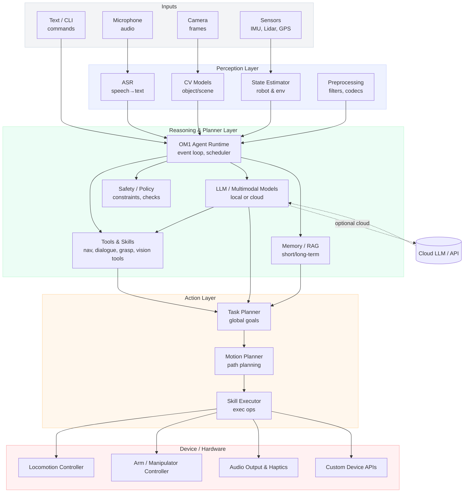

# System Architecture Overview

This page provides a consolidated, high-level architecture diagram of the OM1 system.  
While pieces of the architecture are documented across the repository, this diagram gives developers, integrators, and contributors a single visual overview of how **inputs → perception → reasoning → planning → hardware execution** flow through the OM1 runtime.

## Why This Diagram Is Useful

- Helps new developers and researchers understand the end-to-end data flow.
- Clarifies responsibilities between layers (Perception, Reasoning, Skills/Tools, Device Control).
- Shows where custom integrations, tools, or hardware controllers can be added.
- Makes multimodal input/output and optional cloud components explicit.

---

## OM1 Architecture Diagram

